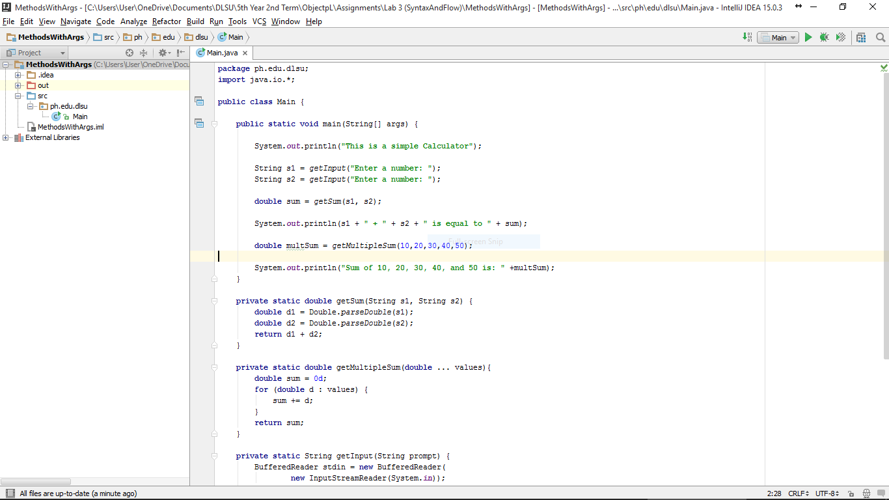
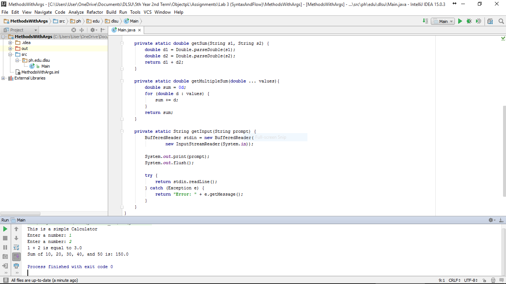

#MethodsWithArgs

Using of methods with aguments.

#ScreenShots

#Code

~~~
package ph.edu.dlsu;
import java.io.*;

public class Main {

    public static void main(String[] args) {

        System.out.println("This is a simple Calculator");

        String s1 = getInput("Enter a number: ");
        String s2 = getInput("Enter a number: ");

        double sum = getSum(s1, s2);

        System.out.println(s1 + " + " + s2 + " is equal to " + sum);

        double multSum = getMultipleSum(10,20,30,40,50);

        System.out.println("Sum of 10, 20, 30, 40, and 50 is: " +multSum);
    }

    private static double getSum(String s1, String s2) {
        double d1 = Double.parseDouble(s1);
        double d2 = Double.parseDouble(s2);
        return d1 + d2;
    }

    private static double getMultipleSum(double ... values){
        double sum = 0d;
        for (double d : values) {
            sum += d;
        }
        return sum;
    }

    private static String getInput(String prompt) {
        BufferedReader stdin = new BufferedReader(
                new InputStreamReader(System.in));

        System.out.print(prompt);
        System.out.flush();

        try {
            return stdin.readLine();
        } catch (Exception e) {
            return "Error: " + e.getMessage();
        }
    }
}
~~~
